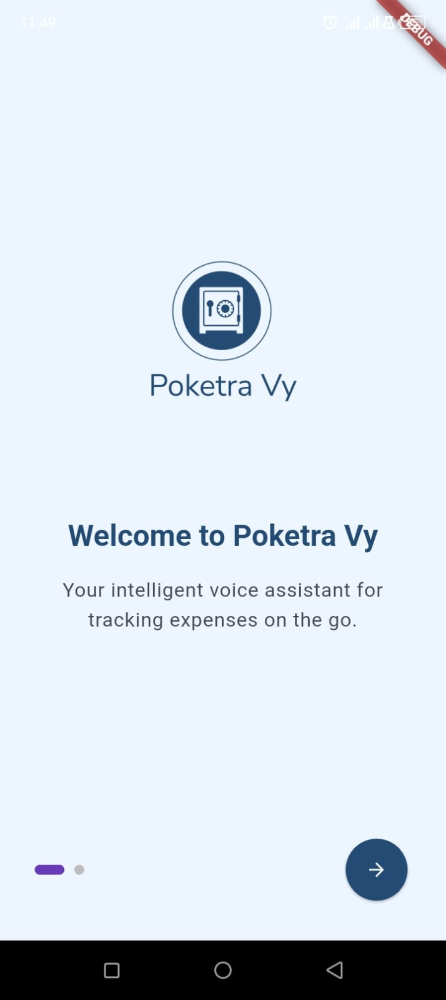
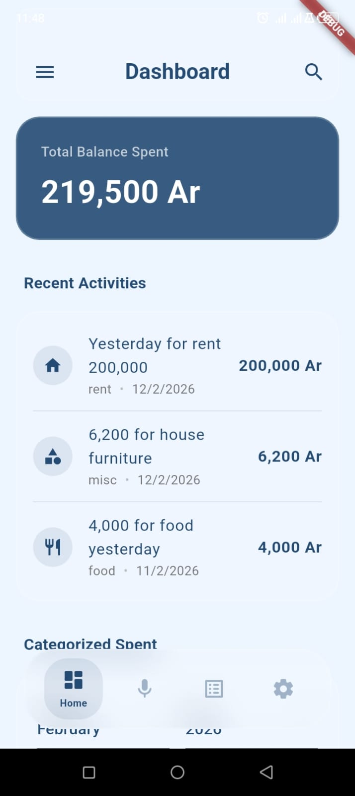
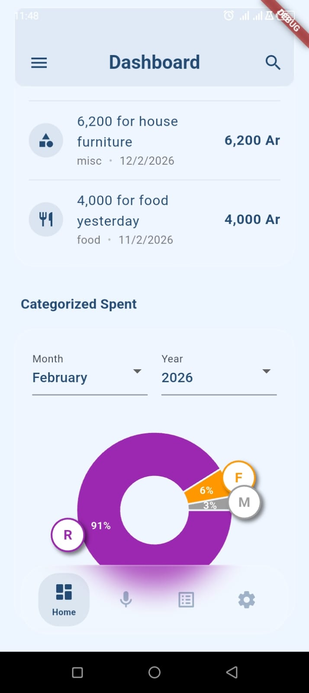
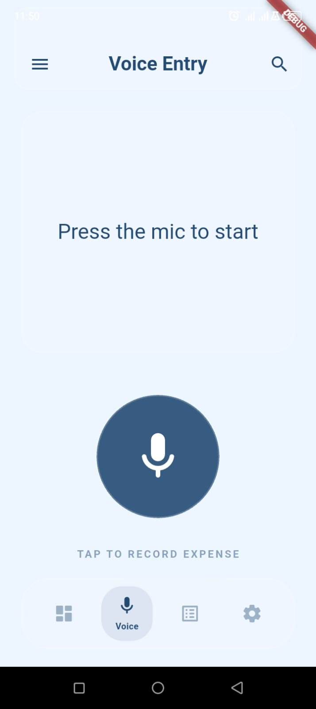
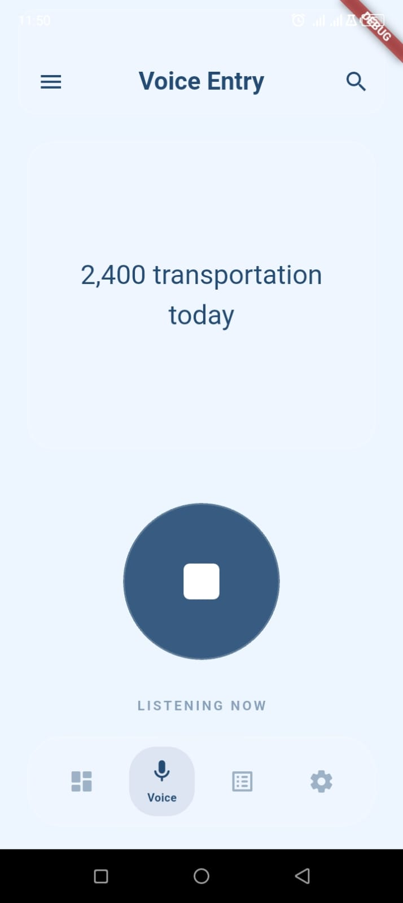
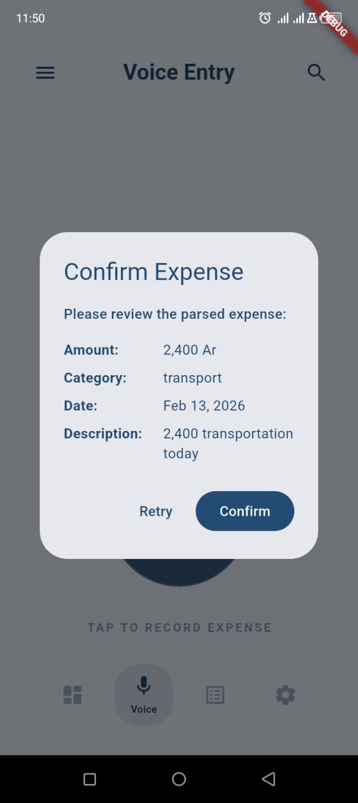
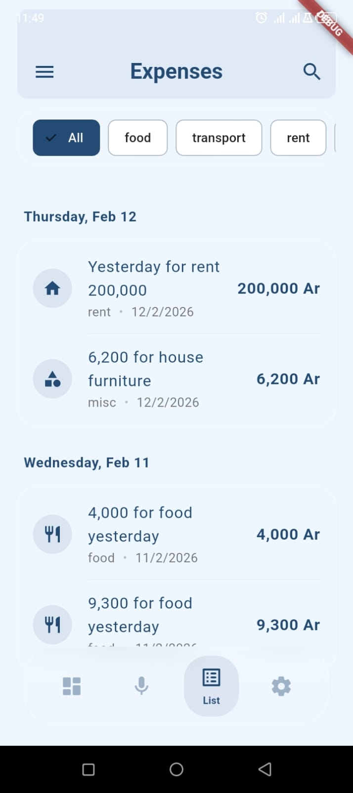
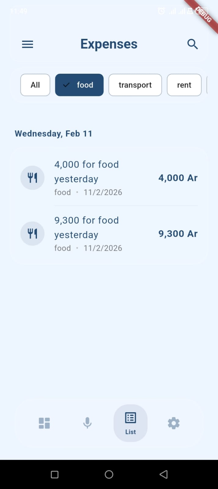
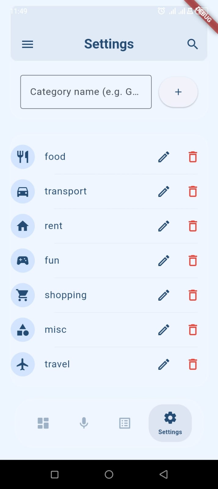

# Poketra-Vy

A smart, voice-activated expense tracker built with Flutter. Record your expenses naturally using your voice, visualize your spending with interactive charts, and keep your data local and secure.

## 📸 Screenshots

### 🚀 Getting Started
<p align="center">
  
  
  
</p>

### 📊 Dashboard & Recent Entries & Chart
<p align="center">
  
  
</p>

### 🎙️ Voice Entry Flow
<p align="center">
  
  
  
</p>

### 📋 Expenses List
<p align="center">
  
  
</p>

### 📋 Settings
<p align="center">
  
  
</p>

## ✨ Features

- **🎙️ Voice Expense Entry**: Simply say "10000 for lunch" or "5000 for transport yesterday" to record expenses effortlessly.
- **🧠 Smart Parsing**: Natural language processing extracts amount, category, date, and description from your speech.
- **✅ Confirmation Flow**: Validate parsed data before saving to ensure accuracy.
- **📊 Interactive Analytics**:
    - **Dynamic Pie Chart**: Visualize spending by category for any specific month and year.
    - **Total Spend Tracking**: Real-time calculation of your total expenses.
    - **Recent Activities**: Quickly view your last 5 expenses from the current week.
- **📅 Organized Expense List**:
    - **Date Grouping**: Expenses are neatly grouped by date with clear headers and dividers.
    - **Dynamic Category Filters**: Filter your history using horizontal chips that reflect your custom categories.
- **⚙️ Settings & Customization**:
    - **Robust Category Management**: Add, edit, and remove categories with unique icons.
    - **ID-Based Linking**: Renaming categories preserves links to all existing expenses.
    - **Revisit Onboarding**: Option to restart the welcome tour anytime.
- **✏️ Manage with Ease**:
    - **Swipe-to-Delete**: Quickly remove expenses with a swipe (includes confirmation).
    - **Bottom Sheet Editing**: Tap any expense to update its details instantly.
- **🚀 Modern UI/UX**:
    - **Clean Interface**: Premium dark-mode ready design with smooth transitions.
    - **Micro-interactions**: Subtle animations for better user feedback.
- **💾 Local Persistence**: Fast and secure NoSQL storage using Hive—your data never leaves your device.

## 🛠️ Technology Stack

- **Framework**: [Flutter](https://flutter.dev)
- **State Management**: [Riverpod](https://riverpod.dev)
- **Navigation**: [GoRouter](https://pub.dev/packages/go_router)
- **Data Persistence**: [Hive](https://hivedb.dev)
- **Voice Recognition**: [speech_to_text](https://pub.dev/packages/speech_to_text)
- **Charts**: [fl_chart](https://pub.dev/packages/fl_chart)
- **Utilities**: [intl](https://pub.dev/packages/intl), [uuid](https://pub.dev/packages/uuid)

## 🏗️ Project Structure

```text
lib/
├── core/               # Shared logic, models, services, and navigation
│   ├── models/         # Data models (Expense)
│   ├── navigation/     # App router and shell
│   ├── services/       # Hive, Voice Parser
│   └── utils/          # Formatting and helpres
├── features/           # Feature-based modules
│   ├── expenses/       # Expense list, editing, and providers
│   └── home/           # Dashboard and charts
└── main.dart           # App entry and initialization
```

## 🚀 Getting Started

1. **Clone the repo**
2. **Install dependencies**: `flutter pub get`
3. **Run the app**: `flutter run`

## 📝 License

This project is open-source under the MIT License.
