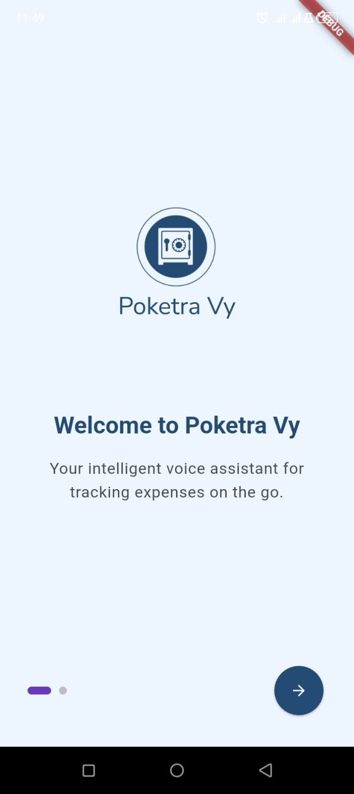
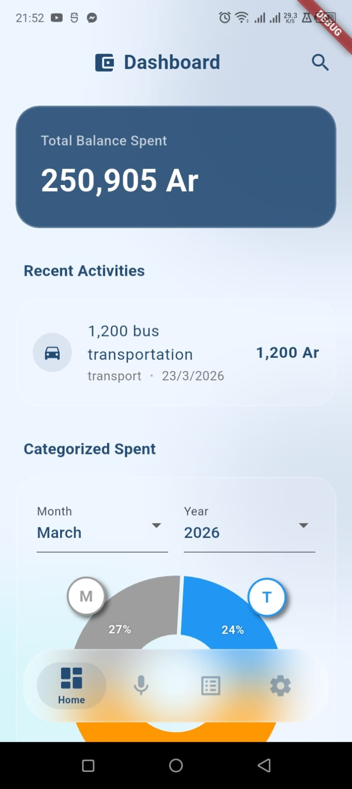
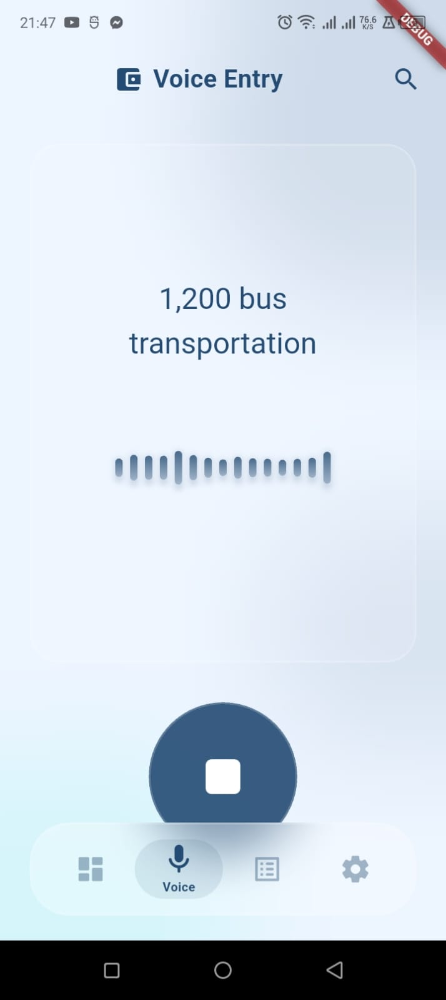
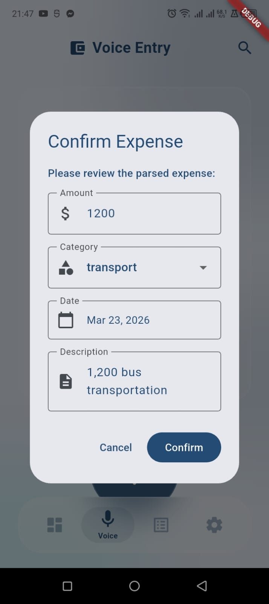
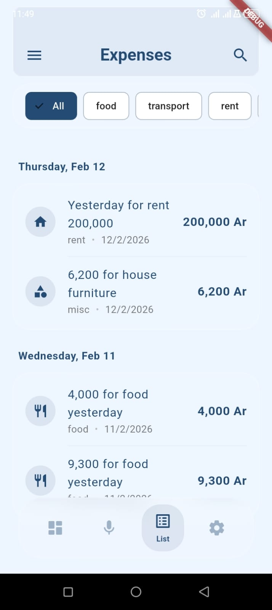
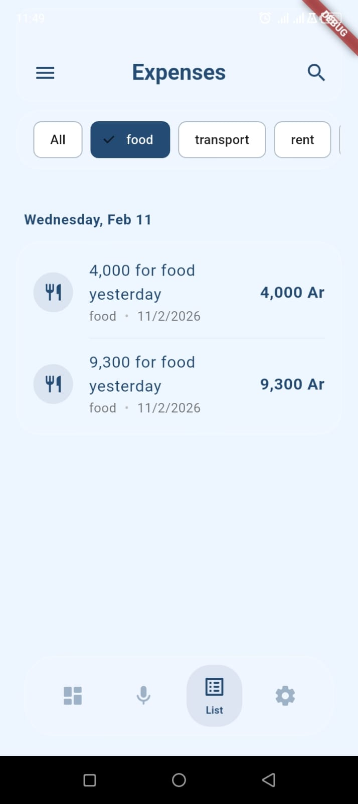
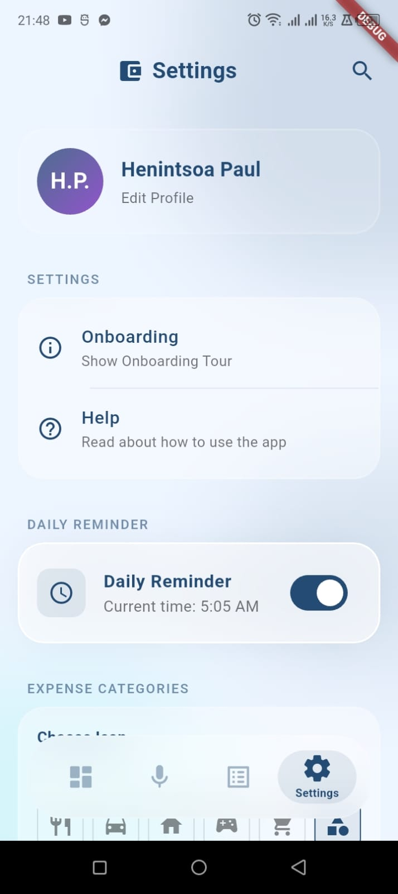
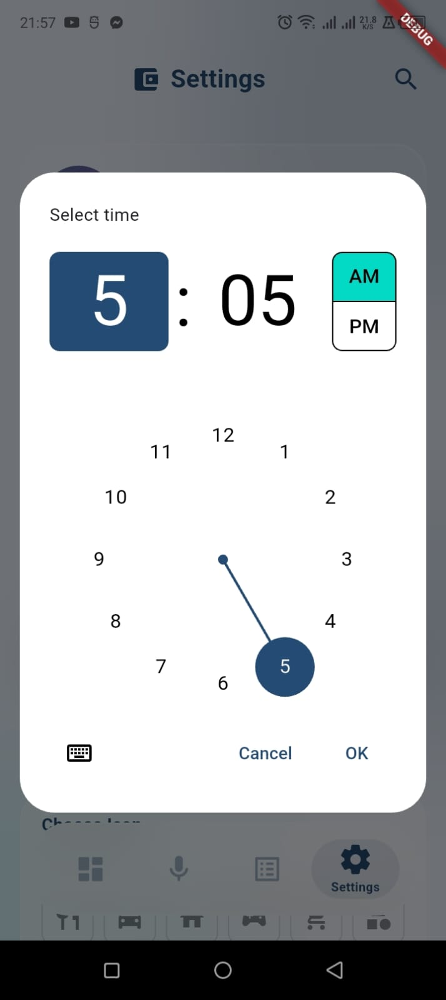
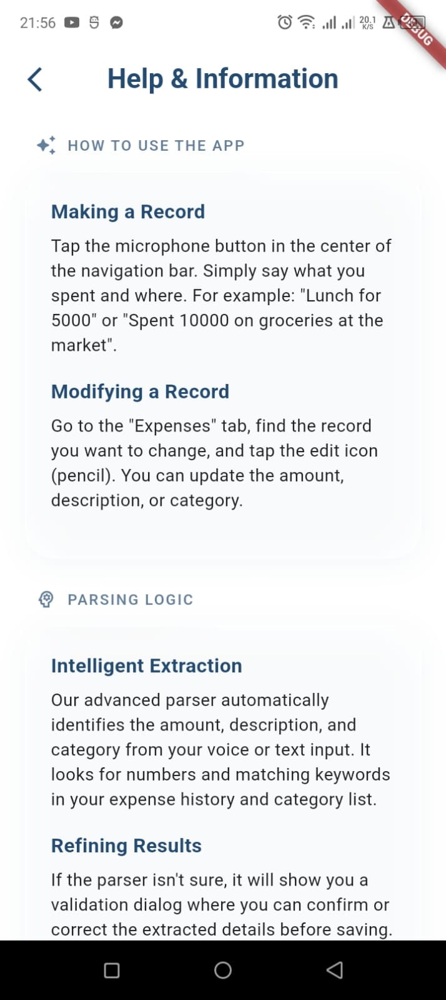

# Poketra-Vy

A smart, voice-activated expense tracker built with Flutter. Record your expenses naturally using your voice, visualize your spending with interactive charts, and keep your data local and secure.

## 📸 Screenshots

### 🚀 Getting Started
<p align="center">
  
  
  
</p>

### 📊 Home
<p align="center">
  
</p>

### 🎙️ Voice Entry Flow
<p align="center">
  
  
  
</p>

### 📋 Expenses List
<p align="center">
  
  
</p>

### ⚙️ Settings
<p align="center">
  
  
</p>

### 🆘 Help
<p align="center">
  
  
</p>

## ✨ Features

- **🎙️ Voice Expense Entry**: Simply say "10000 for lunch" or "5000 for transport yesterday" to record expenses effortlessly.
- **🎵 Live Voice Visualizer**: Real-time waveform animation while recording to give visual feedback on audio capture.
- **🧠 Smart Parsing**: Natural language processing extracts amount, category, date, and description from your speech.
- **✅ Confirmation & Edit Flow**: Validate parsed data before saving and edit any field directly from the confirmation dialog.
- **📊 Interactive Analytics**:
    - **Dynamic Pie Chart**: Visualize spending by category for any specific month and year.
    - **Total Spend Tracking**: Real-time calculation of your total expenses.
    - **Recent Activities**: Quickly view your last 5 expenses from the current week.
- **📅 Organized Expense List**:
    - **Date Grouping**: Expenses are neatly grouped by date with clear headers and dividers.
    - **Dynamic Category Filters**: Filter your history using horizontal chips that reflect your custom categories.
- **⚙️ Settings & Customization**:
    - **Robust Category Management**: Add, edit, and remove categories with unique icons.
    - **ID-Based Linking**: Renaming categories preserves links to all existing expenses.
    - **Revisit Onboarding**: Option to restart the welcome tour anytime.
- **🔔 Daily Reminders**: Configurable daily notification reminders to log your expenses, with time-picker and toggle control.
- **🆘 Help Section**: In-app help guide covering how to use the app, parsing logic, and data privacy.
- **✏️ Manage with Ease**:
    - **Swipe-to-Delete**: Quickly remove expenses with a swipe (includes confirmation).
    - **Unified Edit Dialog**: Tap any expense to update its details via a unified form dialog.
- **🚀 Modern UI/UX**:
    - **Glassmorphism Design**: Premium frosted-glass style with smooth transitions.
    - **Micro-interactions**: Subtle animations for better user feedback.
- **💾 Local Persistence**: Fast and secure NoSQL storage using Hive—your data never leaves your device.
- **🧪 CI Pipeline**: Automated regression tests on push via GitHub Actions.

## 🎙️ Voice Parser Logic

The Poketra-Vy voice parser uses a heuristic-based approach to extract expense details from natural language or text input.

### Processing Rules

- **💰 Amount**: The parser identifies the **first** numeric value in the string.
    - *Example*: "Spent 5000 on food but paid 100 for bag" extracts **5000**.
- **📁 Category**: It performs a case-insensitive search for your defined category names.
    - The **first match** found in the text is assigned.
    - If no match is found, it defaults to the **"misc"** category.
- **📅 Date**:
    - If the word **"yesterday"** is present, the expense is dated to the previous day.
    - Otherwise, it defaults to **today**.
- **📝 Description**: The full input text is preserved as the expense description.

### Expected Processing Cases

| Input                  | Amount | Category       | Date      | Result         |
| :--------------------- | :----- | :------------- | :-------- | :------------- |
| "I spent 5000 on food" | 5000   | food           | Today     | ✅ Success      |
| "5000 food yesterday"  | 5000   | food           | Yesterday | ✅ Success      |
| "5000 something"       | 5000   | misc (default) | Today     | ✅ Success      |
| "10000"                | 10000  | misc (default) | Today     | ✅ Success      |
| "dinner 20000 food"    | 20000  | food           | Today     | ✅ Success      |
| "food today"           | None   | N/A            | N/A       | ❌ Fails (Null) |
| "" (Empty)             | None   | N/A            | N/A       | ❌ Fails (Null) |

## 🛠️ Technology Stack

- **Framework**: [Flutter](https://flutter.dev)
- **State Management**: [Riverpod](https://riverpod.dev)
- **Navigation**: [GoRouter](https://pub.dev/packages/go_router)
- **Data Persistence**: [Hive](https://hivedb.dev)
- **Voice Recognition**: [speech_to_text](https://pub.dev/packages/speech_to_text)
- **Charts**: [fl_chart](https://pub.dev/packages/fl_chart)
- **Notifications**: [flutter_local_notifications](https://pub.dev/packages/flutter_local_notifications)
- **Utilities**: [intl](https://pub.dev/packages/intl), [uuid](https://pub.dev/packages/uuid), [timezone](https://pub.dev/packages/timezone)
- **Testing**: [flutter_test](https://pub.dev/packages/flutter_test), [mocktail](https://pub.dev/packages/mocktail)
- **CI/CD**: [GitHub Actions](https://github.com/features/actions)

## 🏗️ Project Structure

```text
lib/
├── core/               # Shared logic, models, services, and navigation
│   ├── models/         # Data models (Expense, Category)
│   ├── navigation/     # App router and shell
│   ├── providers/      # Global providers (onboarding, etc.)
│   ├── services/       # Hive, Voice Parser, Notifications
│   ├── utils/          # Formatting and helpers
│   └── widgets/        # Shared widgets (GlassContainer, etc.)
├── features/           # Feature-based modules
│   ├── category/       # Category selection UI
│   ├── expenses/       # Expense list, voice entry, editing, and providers
│   ├── home/           # Dashboard and charts
│   ├── onboarding/     # Onboarding flow
│   └── settings/       # Settings, reminders, help section
└── main.dart           # App entry and initialization
```

## 🚀 Getting Started

1. **Clone the repo**
2. **Install dependencies**: `flutter pub get`
3. **Run the app**: `flutter run`

## 📝 License

This project is open-source under the MIT License.
